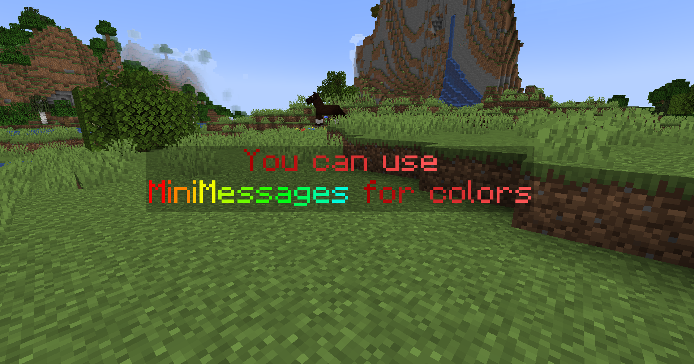
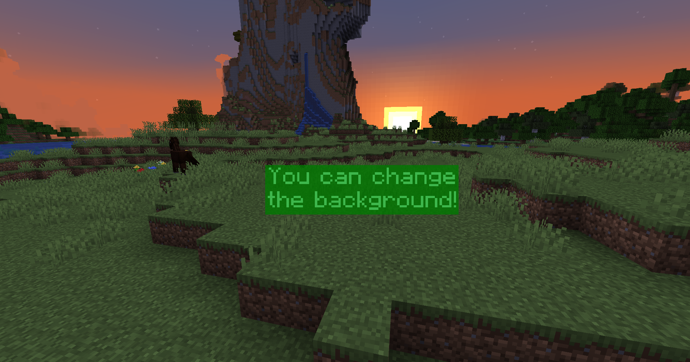
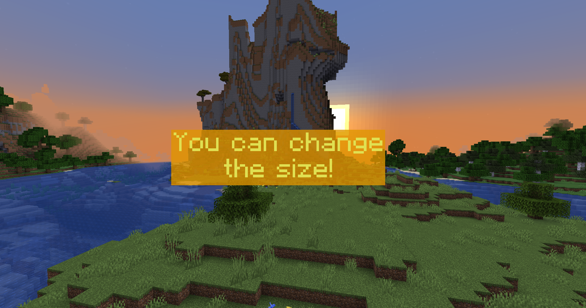
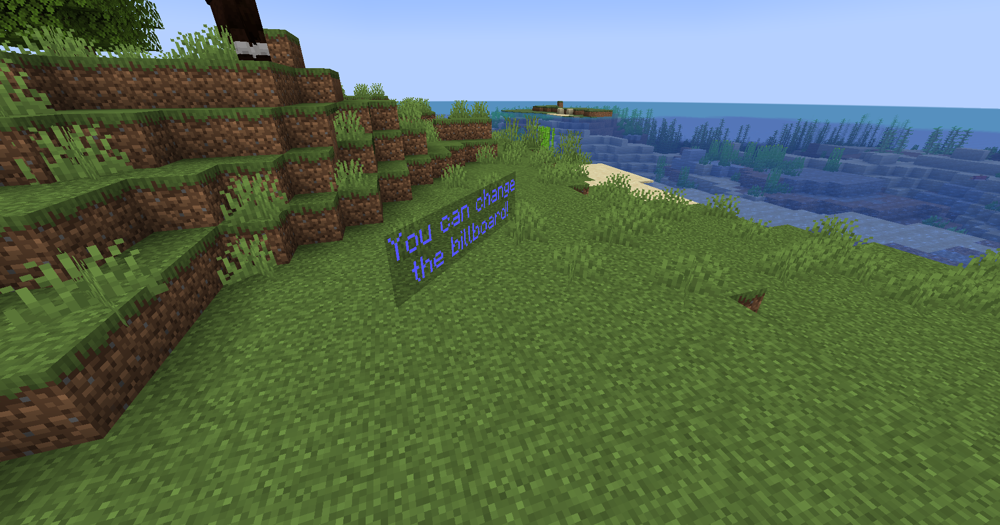

#       

Simple, lightweight and fast hologram plugin using display entities. 
It is lightweight and fast (using [packets](https://wiki.vg/Protocol)).

PlaceholderAPI and MiniPlaceholders is supported.

**Only for minecraft server versions 1.19.4 .. 1.20.1** 
_Using [paper](https://papermc.io/downloads) is highly recommended_

## Get the plugin

You can download the latest versions at the following places:

- https://hangar.papermc.io/Oliver/FancyHolograms
- https://modrinth.com/plugin/fancyholograms
- https://github.com/FancyMcPlugins/FancyHolograms/releases
- https://www.spigotmc.org/resources/fancyholograms.108694/
- Build from source (``gradlew shadowJar``)

## Commands

/FancyHolograms version - Shows you the current plugin version 
/FancyHolograms save - Saves all holograms 
/FancyHolograms reload - Reloads the config and holograms 
/Hologram help - Shows a list of all subcommands 
/Hologram list - Shows a list of all holograms 
/Hologram create (name) - Creates a new hologram at your location 
/Hologram remove (hologram) - Removes a certain hologram 
/Hologram copy (hologram) (new name) - Creates a copy of a hologram 
/Hologram edit (hologram) position - Teleports the hologram to you 
/Hologram edit (hologram) moveTo (x) (y) (z) [yaw] - Teleports the hologram to the location 
/Hologram edit (hologram) rotate (degrees) - Rotates the hologram 
/Hologram edit (hologram) setLine (line) (text...) - Sets the content of the line 
/Hologram edit (hologram) addLine (text...) - Adds a line at the bottom 
/Hologram edit (hologram) removeLine (line) - Removes a line 
/Hologram edit (hologram) insertBefore (line) (text...) - Adds a line after another 
/Hologram edit (hologram) insertAfter (line) (text...) - Adds a line before another 
/Hologram edit (hologram) background (color) - Sets the background color 
/Hologram edit (hologram) scale (factor) - Sets the scale (can be floats) 
/Hologram edit (hologram) billboard (billboard) - Sets the billboard 
/Hologram edit (hologram) textShadow (true|false) - Enables/disables the text shadow 
/Hologram edit (hologram) shadowStrength (strength) - Sets the shadow strength 
/Hologram edit (hologram) shadowRadius (radius) - Sets the shadow radius 
/Hologram edit (hologram) updateTextInterval (seconds) - Sets the interval for refreshing the text (useful for
placeholders) 
/Hologram edit (hologram) linkWithNpc (npc) - Links a hologram with an NPC 
/Hologram edit (hologram) unlinkWithNpc - Unlinks the hologram from the NPC 

## Permissions

For the /Hologram and /FancyHolograms commands - ``FancyHolograms.admin``

## Example images

